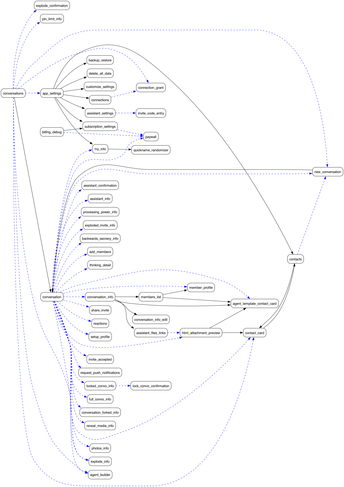

# convos-shared

Cross-platform shared artifacts that back the Convos iOS and Android clients.

## Layout

- `metrics/` — Kotlin Gradle project. Declares metrics descriptors (events, user properties, navigation graph) and runs KSP codegen against them.
- `ConvosMetrics/` — generated Swift Package, mirrored out of the KSP build so iOS can consume it as an SPM dependency. **Do not hand-edit.** Re-run `./gradlew build` inside `metrics/` to regenerate.
- `docs/` — protocol notes.
- `.githooks/` — shared git hooks. Install once with `./scripts/install-hooks.sh`.

## Building

```sh
cd metrics
./gradlew build
```

This runs KSP, regenerates the Swift package into `<repo>/ConvosMetrics/`, and splices the metrics catalog below into this README.

## Pre-commit

A pre-commit hook runs `./gradlew build` and aborts the commit if the regenerated Swift package or this README differ from what's staged. Activate it once per clone with:

```sh
./scripts/install-hooks.sh
```

That sets `core.hooksPath=.githooks` for the local repo.

## Metrics catalog

The section between the AUTOGEN markers below is regenerated by the build from the descriptors under `metrics/descriptors/src/main/kotlin/org/convos/metrics/descriptors/`.

<!-- AUTOGEN:METRICS START -->

# Metrics

## Core Actions

| Event | Function | Parameters |
|-------|----------|------------|
| `started_conversation` | `startedConversation` | _none_ |
| `joined_conversation` | `joinedConversation` | `verification_duration`: Float<br>`member_count`: Int<br>`has_assistant`: Boolean<br>`source`: ConversationSource { URL, Scan, Paste, Message } |
| `invited_to_conversation` | `invitedToConversation` | `member_count`: Int<br>`has_assistant`: Boolean |
| `added_assistant` | `addedAssistant` | `member_count`: Int |
| `sent_message` | `sentMessage` | `sending_time`: Float<br>`member_count`: Int<br>`attachment_types`: List<br>`has_text`: Boolean<br>`has_assistant`: Boolean<br>`is_success`: Boolean |
| `purchase_initiated` | `purchaseInitiated` | `product_id`: String<br>`tier`: SubscriptionTier { BUILDER, PRO }<br>`period`: SubscriptionPeriod { MONTHLY, ANNUAL }<br>`source`: PaywallSource { SETTINGS, LOW_BALANCE_BANNER, ONBOARDING, MEMBER_CARD, DEBUG } |
| `purchase_succeeded` | `purchaseSucceeded` | `product_id`: String<br>`tier`: SubscriptionTier { BUILDER, PRO }<br>`period`: SubscriptionPeriod { MONTHLY, ANNUAL }<br>`source`: PaywallSource { SETTINGS, LOW_BALANCE_BANNER, ONBOARDING, MEMBER_CARD, DEBUG }<br>`duration_secs`: Float |
| `purchase_cancelled` | `purchaseCancelled` | `product_id`: String<br>`source`: PaywallSource { SETTINGS, LOW_BALANCE_BANNER, ONBOARDING, MEMBER_CARD, DEBUG } |
| `purchase_failed` | `purchaseFailed` | `product_id`: String<br>`source`: PaywallSource { SETTINGS, LOW_BALANCE_BANNER, ONBOARDING, MEMBER_CARD, DEBUG }<br>`reason`: PurchaseFailureReason { PRODUCT_NOT_FOUND, PURCHASE_PENDING, PURCHASE_UNVERIFIED, BACKEND_VERIFY_UNAVAILABLE, BILLING_CLIENT_UNAVAILABLE, UNKNOWN } |
| `purchases_restored` | `purchasesRestored` | `restored_count`: Int |

## User Properties

| Key | Field | Type | Nullable |
|-----|-------|------|----------|
| `has_messaged_assistant` | `hasMessagedAssistant` | Boolean | no |
| `last_assistant_message_timestamp` | `lastAssistantMessageTimestamp` | String | yes |
| `contact_count` | `contactCount` | Int | no |
| `conversation_count` | `conversationCount` | Int | no |
| `assistant_conversation_count` | `assistantConversationCount` | Int | no |
| `conversation_count24_hours` | `conversationCount24Hours` | Int | no |
| `conversation_count7_days` | `conversationCount7Days` | Int | no |
| `max_active_convo_age` | `maxActiveConvoAge` | Float | no |

## Navigators



Graph source: [`navigators.dot`](navigators.dot). `navigators.png` is re-rendered by the build when Graphviz is installed.

| Screen | Args | Outgoing |
|--------|------|----------|
| `conversations` | _none_ | navigateTo → `Conversation`<br>present → `AppSettings`<br>present → `NewConversation`<br>present → `ExplodeConfirmation`<br>present → `ConnectionGrant`<br>present → `ExplodeInfo`<br>present → `PinLimitInfo`<br>present → `ContactCard`<br>present → `AgentBuilder` |
| `conversation` | `conversationId`: String | present → `Paywall`<br>present → `ConversationInfo`<br>present → `MyInfo`<br>present → `MemberProfile`<br>present → `ShareInvite`<br>present → `NewConversation`<br>present → `Reactions`<br>present → `ExplodeInfo`<br>present → `LockedConvoInfo`<br>present → `FullConvoInfo`<br>present → `ConversationForkedInfo`<br>present → `RevealMediaInfo`<br>present → `PhotosInfo`<br>present → `AssistantConfirmation`<br>present → `AssistantInfo`<br>present → `ProcessingPowerInfo`<br>present → `ExplodedInviteInfo`<br>present → `SetupProfile`<br>present → `InviteAccepted`<br>present → `RequestPushNotifications`<br>present → `BackwardsSecrecyInfo`<br>present → `AddMembers`<br>present → `ContactCard`<br>present → `AgentTemplateContactCard`<br>present → `AgentBuilder`<br>present → `ThinkingDetail`<br>present → `HtmlAttachmentPreview` |
| `app_settings` | _none_ | navigateTo → `MyInfo`<br>navigateTo → `CustomizeSettings`<br>navigateTo → `AssistantSettings`<br>navigateTo → `Connections`<br>navigateTo → `BackupRestore`<br>navigateTo → `DeleteAllData`<br>navigateTo → `SubscriptionSettings`<br>navigateTo → `Contacts` |
| `new_conversation` | `mode`: NewConversationMode { CREATE, SCANNER, JOIN_INVITE }<br>`inviteCode`: String? | navigateTo → `Conversation` |
| `explode_confirmation` | `conversationId`: String | _leaf_ |
| `conversation_info` | `conversationId`: String | navigateTo → `ConversationInfoEdit`<br>navigateTo → `MembersList`<br>navigateTo → `AssistantFilesLinks`<br>navigateTo → `AgentTemplateContactCard` |
| `conversation_info_edit` | `conversationId`: String | _leaf_ |
| `members_list` | `conversationId`: String | navigateTo → `MemberProfile`<br>navigateTo → `AgentTemplateContactCard` |
| `member_profile` | `conversationId`: String<br>`memberId`: String | _leaf_ |
| `share_invite` | `conversationId`: String | _leaf_ |
| `reactions` | `conversationId`: String<br>`messageId`: String | _leaf_ |
| `assistant_files_links` | `conversationId`: String | present → `HtmlAttachmentPreview` |
| `setup_profile` | _none_ | _leaf_ |
| `invite_accepted` | _none_ | _leaf_ |
| `request_push_notifications` | _none_ | _leaf_ |
| `my_info` | _none_ | navigateTo → `QuicknameRandomizer` |
| `customize_settings` | _none_ | _leaf_ |
| `assistant_settings` | _none_ | present → `InviteCodeEntry` |
| `connections` | _none_ | present → `ConnectionGrant` |
| `backup_restore` | _none_ | _leaf_ |
| `delete_all_data` | _none_ | _leaf_ |
| `quickname_randomizer` | _none_ | _leaf_ |
| `invite_code_entry` | _none_ | _leaf_ |
| `connection_grant` | `serviceId`: String<br>`conversationId`: String | _leaf_ |
| `explode_info` | _none_ | _leaf_ |
| `pin_limit_info` | _none_ | _leaf_ |
| `locked_convo_info` | `conversationId`: String | present → `LockConvoConfirmation` |
| `full_convo_info` | _none_ | _leaf_ |
| `conversation_forked_info` | `conversationId`: String | _leaf_ |
| `reveal_media_info` | _none_ | _leaf_ |
| `photos_info` | _none_ | _leaf_ |
| `assistant_confirmation` | `conversationId`: String | _leaf_ |
| `assistant_info` | _none_ | _leaf_ |
| `processing_power_info` | _none_ | _leaf_ |
| `exploded_invite_info` | _none_ | _leaf_ |
| `backwards_secrecy_info` | _none_ | _leaf_ |
| `lock_convo_confirmation` | `conversationId`: String | _leaf_ |
| `contacts` | _none_ | navigateTo → `ContactCard`<br>present → `NewConversation` |
| `contact_card` | `inboxId`: String<br>`conversationId`: String? | navigateTo → `Contacts` |
| `agent_template_contact_card` | `templateId`: String<br>`inboxId`: String<br>`conversationId`: String? | _leaf_ |
| `add_members` | `conversationId`: String<br>`conversationTitle`: String? | _leaf_ |
| `agent_builder` | `conversationId`: String | _leaf_ |
| `thinking_detail` | `conversationId`: String<br>`senderInboxId`: String<br>`messageId`: String | _leaf_ |
| `html_attachment_preview` | `conversationId`: String?<br>`senderInboxId`: String? | navigateTo → `ContactCard`<br>navigateTo → `AgentTemplateContactCard` |
| `paywall` | `source`: PaywallSource { SETTINGS, LOW_BALANCE_BANNER, ONBOARDING, MEMBER_CARD, DEBUG } | _leaf_ |
| `subscription_settings` | _none_ | present → `Paywall` |
| `billing_debug` | _none_ | present → `Paywall`<br>navigateTo → `SubscriptionSettings` |

<!-- AUTOGEN:METRICS END -->
